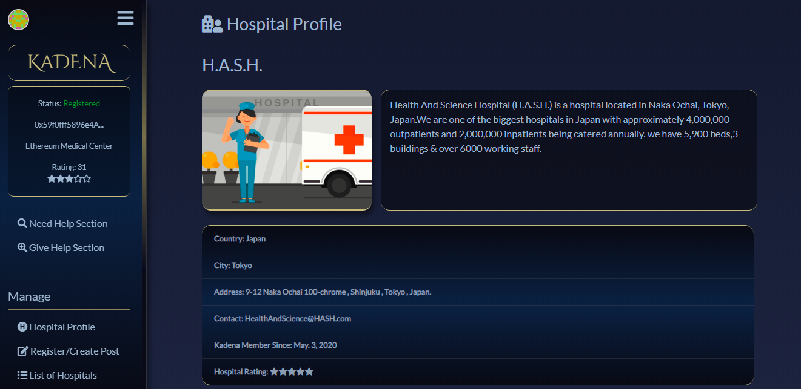

## Stop COVID-19 Hackathon Deliverables

1. Website  
* [Try it here](https://kadena-platform.netlify.app/)  
2. Demo & Pitch PDF  
* [Video (YouTube)](https://www.youtube.com/watch?v=-u1JTVj126M)  
* [Kadena Pitch](kadenapitch.pdf) 

## About Kadena
Kadena is a proof of concept platform on which hospitals could register & exchange vital equipments & form alliance with other hospitals.
The goal of Kadena is to strengthen the healthcare system by encouraging collaboration & sharing of resources with each other to help better fight the COVID-19 pandemic & to improve the overall health service one provides. Hospitals could also have access 
to unique research and technology, & could reduce cost by borrowing essential equipment to other hospitals for a given time.

 

## Local
Try it on your Local.
Clone or Download https://github.com/JanMooMoo/Kadena.git
In the project directory, you can run:

### `npm install`
Install dependencies of the application.

### `npm start`

Runs the app in the development mode. 
Open [http://localhost:3000](http://localhost:3000) to view it in the browser.

The page will reload if you make edits. 

## Tools & Technology used
* Solidity - Smart Contract           
* Truffle - Smart Contract Compilation        
* Ganace-CLI - Smart Contract Deployment      
* Drizzle - Reactive User Interface     
* Web3.js - Blockchain Connection       
* Infura API - Blockchain Connection     
* Infura IPFS - Decentralized storage    
